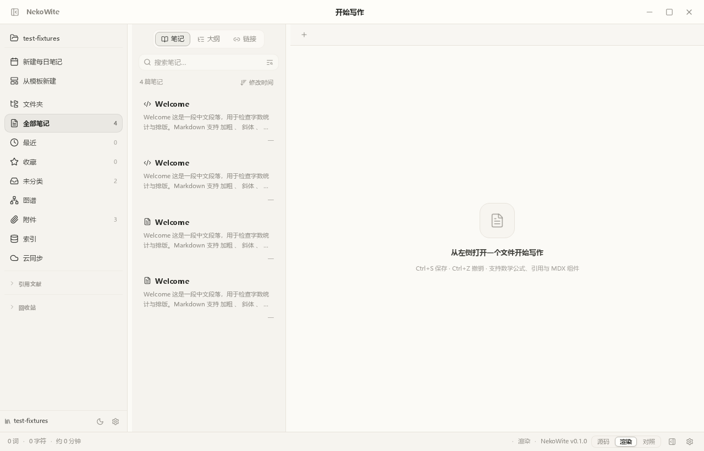

# NekoWite

> 把 Markdown / MDX 的可控性，带回像 Word 一样自然的写作体验。

[](https://tauri.app/)
[](https://vuejs.org/)
[](https://www.typescriptlang.org/)
[](#项目状态)

NekoWite 是一个面向写作者、研究者和知识工作者的开源桌面编辑器。它让你在熟悉的所见即所得界面里写作，同时保留 Markdown、MDX、数学公式、引用和可扩展组件的长期可维护性。

**[快速开始](#快速开始)** · **[核心能力](#核心能力)** · **[插件开发](#插件开发)** · **[安全边界](#安全边界)**



## 为什么是 NekoWite

- **写作时专注内容**：默认使用所见即所得编辑，源码、渲染和对照视图随时切换。
- **文件始终可控**：文档落在自己的 vault 中，保留 YAML frontmatter，并支持外部编辑热重载。
- **复杂内容也能顺手写**：表格、数学公式、引用和 MDX 组件都可以在同一份文档里协作。
- **从编辑到发布**：支持 PDF / HTML 导出，也可以用 AI 辅助起草、改写和延展内容。

## 核心能力

| 场景 | 你可以做什么 |
| --- | --- |
| **专注写作** | 多标签、文件树、搜索、三态视图、状态栏，以及接近桌面文字处理器的编辑体验 |
| **结构化内容** | Markdown / MDX 往返保真、YAML frontmatter、表格网格编辑、自定义 JSX / MDX 节点 |
| **研究与引用** | 导入 `.bib`、`.ris`、CSL 数据，在侧栏管理 `@citekey` 并自动编号 |
| **公式与发布** | MathLive 可视化公式编辑，支持 `$…$` / `$$…$$`，导出渲染后的 PDF 与 HTML |
| **AI 辅助** | BYOK 连接 OpenAI、Claude、Gemini、Grok、LM Studio 或 Ollama，使用 ghost-writer 快速生成草稿 |
| **个人工作流** | 文档信息、历史版本、回收站、浮动图片 / 文本框 / 贴纸，以及主题设置 |

## 适合谁

**长文作者**：在一个 vault 里维护章节、设定和素材，随时在源码与成稿之间切换。

**研究与知识工作者**：把公式、参考文献、表格和说明文字放在同一份可版本化的文档中。

**喜欢折腾的开发者**：通过插件注册 MDX 组件、工具栏按钮和命令，把自己的工作流接进编辑器。

## 快速开始

环境要求：Node.js 22、pnpm 11。桌面开发还需要 Rust stable 和 Tauri v2 的系统依赖。

```bash
git clone https://github.com/NekoRain404/NekoWite.git
cd NekoWite
pnpm install

# 浏览器开发模式
pnpm dev

# 完整 Tauri 桌面应用
pnpm tauri dev
```

## 项目状态

NekoWite 目前处于持续开发阶段。核心编辑、文件管理、公式、引用、导出、AI 和插件能力已经在代码库中实现；跨平台打包、插件沙箱和更完整的发布流程仍在完善。

项目使用 GitHub Actions 持续检查类型、代码风格、单元测试、E2E、构建和 Rust 工程。由于功能仍在快速迭代，建议在升级依赖或提交重要文档前运行本地检查。

## 开发者入口

```bash
pnpm typecheck       # 全仓库类型检查
pnpm lint            # ESLint
pnpm test            # Vitest 单元测试
pnpm test:e2e        # Playwright 关键路径
pnpm build           # 桌面前端构建

# Rust 命令层
cd apps/desktop/src-tauri
cargo test
```

主要目录：

```text
apps/desktop/              Vue 应用与 Tauri 壳
packages/editor-core/      Markdown / MDX 编辑与序列化
packages/plugin-host/      插件加载、注册与权限确认
docs/                      设计文档与项目资料
```

## 插件开发

插件可以注册自定义 MDX 组件、工具栏按钮和命令。最小形态如下：

```ts
import { definePlugin } from '@nekowite/plugin-host'

export default definePlugin({
  name: 'Quote',
  toolbar: [{
    id: 'quote.insert',
    label: '插入 Quote',
    run: () => {},
  }],
})
```

插件由 `@nekowite/plugin-host` 负责加载、激活、生命周期管理和失败回滚。更完整的 API 以仓库中的类型定义和实现为准。

## 安全边界

当前插件运行在主窗口的同一 JavaScript 上下文中，**还不是 webview / worker 隔离沙箱**。插件与主应用共享运行环境，理论上可能触达应用注册表和 Tauri IPC；因此请只安装你信任的本地插件。

插件可以在 manifest 或 `definePlugin` 中声明 `ai`、`fs`、`network`、`clipboard` 权限。声明敏感能力的插件会在激活前请求确认；未声明权限的插件按纯 UI 插件处理，敏感能力默认拒绝。真正的沙箱隔离仍在路线图中。

## 路线图

- 更完整的跨平台打包与发布渠道
- webview / worker 级别的插件沙箱
- 更丰富的主题、模板和协作能力
- 更稳定的 E2E 覆盖与插件生态文档

## 参与贡献

欢迎提交 Issue、改进文档或发起 Pull Request。涉及编辑器行为、文件读写和插件权限的改动，请同时补充对应测试，并在 PR 中说明兼容性影响。

## 许可证

仓库当前未附带独立的 LICENSE 文件。代码使用前请先确认项目维护者发布的许可说明。

## 构建与打包

```bash
bash scripts/package-win.sh
# 产物：release/nekowite_<version>_x64-setup.exe
```
