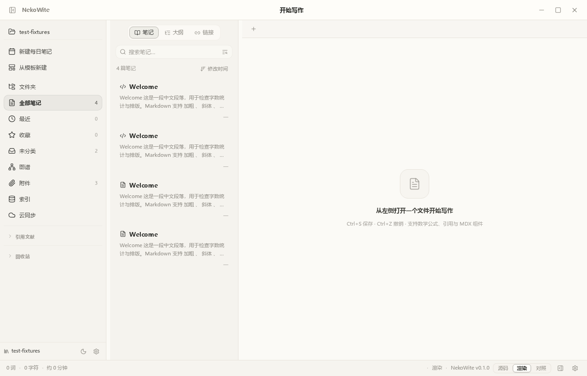

# NekoWite

> 把 Markdown / MDX 的可控性，带回像 Word 一样自然的写作体验。

A local-first desktop knowledge base: WYSIWYG writing, files that stay plain Markdown.

本地优先的开源桌面知识库：在所见即所得里写作，文件仍是你自己的 Markdown。

[](https://github.com/NekoRain404/NekoWite/actions/workflows/ci.yml)
[](LICENSE)
[](https://tauri.app/)
[](https://vuejs.org/)
[](https://www.typescriptlang.org/)

**[功能](#核心能力)** · **[安装](#安装与版本)** · **[使用](#使用)** · **[从源码运行](#从源码运行)** · **[文档](#文档)** · **[贡献](#参与贡献)** · **[许可证](#许可证)**



## 为什么是 NekoWite

- **写作时看成稿**：默认所见即所得，随时切到源码或左右对照。
- **文件始终是你的**：知识库就是一个普通文件夹，带 YAML frontmatter，可被 Git 和其它编辑器使用；外部改动会热重载。
- **复杂内容不必绕路**：表格、数学公式、参考文献和 MDX 组件写在同一份文档里。
- **写完就能发出去**：导出渲染后的 PDF / HTML；需要时用自己的 API Key 接 AI 起草、改写和续写。

## 核心能力

| 场景 | 你可以做什么 |
| --- | --- |
| **专注写作** | 多标签、文件树、全文搜索、三态视图、命令面板 |
| **结构化内容** | Markdown / MDX 往返保真、YAML frontmatter、表格网格、Callout / FloatBox |
| **研究与引用** | 导入 `.bib`、`.ris`、CSL，侧栏管理 `@citekey` 并自动编号 |
| **公式与发布** | MathLive 可视化编辑 `$…$` / `$$…$$`，导出 HTML 与 PDF |
| **AI 辅助** | 自备密钥；续写（Tab）、侧栏聊天、选区改写 / 润色 / 翻译。可接 OpenAI、Claude、Gemini、Grok、DeepSeek，或本地 LM Studio / Ollama |
| **智能体** | 右侧栏的智能体面板，在当前知识库工作；可扫描、注册和编辑本机 ACP 智能体。完全版附带 OpenCode，ACP 版使用用户安装的引擎 |
| **同步与远程** | 知识库内手动执行 Git 提交、拉取、推送；通过 SSHFS 挂载远程目录实时编辑，或通过 rsync 导入副本 |
| **桌面宠物** | 一个可以待在桌面上的角色窗口（外加一只浮球），七个设置子页：常规与交互、角色与动画、气泡与消息、通知与声音、养成与统计、项目与多角色、高级与集成 |
| **个人工作流** | 每日笔记、模板、维基链接、知识图谱、历史版本、回收站、主题 |

## 适合谁

**长文作者**：在一个知识库里维护章节、设定和素材，随时在源码与成稿之间切换。

**研究与知识工作者**：把公式、参考文献、表格和说明放在同一份可版本化的文档中。

**喜欢扩展的人**：内置 Callout、FloatBox、文档状态随应用提供。用户插件的加载器已经写好，但发行版出于隔离尚未完成，**不会加载** vault 里的第三方插件。

## 使用

1. 启动后选择一个文件夹，它就成为你的**知识库**（空文件夹也可以）。
2. 直接在中间编辑区写作；`Ctrl+S` 保存，默认还会自动保存。
3. 用底部状态栏在「渲染 / 源码 / 对照」之间切换。
4. 需要 AI 时：设置 → AI，填写服务商、模型和密钥（密钥加密存在本机，界面只显示已配置）。

「云同步」使用本机 Git：配置远端后手动提交、拉取和推送，不会后台自动同步。SSH 远程工作区需要本机安装 `sshfs`（实时挂载）或 `rsync`（复制导入）；详见[用户指南](docs/USER-GUIDE.md)。

更完整的界面说明见 [用户指南](docs/USER-GUIDE.md)，隐私边界见 [PRIVACY.md](docs/PRIVACY.md)。

## 安装与版本

Linux 提供两个发行方向：

- **完全版**：应用旁边附带经过校验的 OpenCode 引擎，适合第一次使用智能体的用户。
- **ACP 版**：只包含应用本体，启动时调用用户已经安装并配置好的 ACP 智能体，适合已有本地 Agent 环境的用户。

两种版本都需要系统提供 GTK / WebKitGTK。完全版的便携目录必须同时保留 `nekowite_*_x64` 与 `opencode`；ACP 版不包含智能体运行时。当前正式打包目标是 Linux x86_64，Arch 包、便携二进制以及 deb / rpm / AppImage 的构建命令见 [发布指南](docs/RELEASING.md)。

### ACP 与远程工作区

设置 → 智能体会扫描 PATH 和常见安装目录，识别可执行的 ACP 程序；扫描结果可以直接加入注册表，也可以手动填写绝对路径、启动参数和适配器。启动失败时界面会保留诊断信息，不会把普通 CLI 当成 ACP 静默使用。

知识库支持两种远程工作流：Git 面板用于手动提交、拉取和推送；文件夹右键菜单用于添加 SSH 工作区。实时编辑依赖 `sshfs`，复制导入依赖 `rsync`；认证可使用 SSH Agent、私钥或密码。FTP/SFTP 图形化连接尚未作为独立协议提供，SFTP 请通过 SSH/sshfs 使用。

## 从源码运行

环境：Node.js 22、pnpm 11。跑桌面应用还需要 Rust stable 和 [Tauri v2 系统依赖](https://v2.tauri.app/start/prerequisites/)。

```bash
git clone https://github.com/NekoRain404/NekoWite.git
cd NekoWite
pnpm install

# 浏览器里预览前端
pnpm dev

# 完整桌面应用
pnpm tauri dev
```

### Linux 打包

```bash
pnpm --filter @nekowite/desktop exec tauri build --no-bundle
pnpm package:portable:full   # release/nekowite_<version>_x64 + release/opencode
pnpm package:portable:acp    # release/nekowite-acp_<version>_x64/nekowite
pnpm package:arch:full       # Arch 包，含 OpenCode
pnpm package:arch:acp        # Arch 包，使用本机 ACP 智能体
```

ACP 版是单个应用 ELF，但仍依赖系统 GTK / WebKitGTK 和用户安装的 ACP 智能体。完全版的便携 ELF 需要旁边的 `opencode`，不能只复制应用文件。Arch 包在 Arch Linux 上用 `makepkg` 构建；deb / rpm / AppImage 的旧流程仍可用 `pnpm package:linux`。具体校验与产物见[发布指南](docs/RELEASING.md)。

当前 Linux 发布脚本面向 x86_64 / glibc；完全版附带的 OpenCode 引擎同样是 x86_64。不要把从其他架构自行构建的应用当成已验证的发行包。

## 项目状态

当前预览版本 **0.99 Beta**（构建版本 `0.99.0-beta.1`）。Linux 是当前仓库的测试和打包目标，提供完全版与依赖本机智能体的 ACP 版。项目使用单一 `main` 分支；尚无自动更新，第三方 vault 插件在发行版中不加载。Beta 发布仍建议完成原生 WebKitGTK、真实 ACP 启动和远程工作区的人工验收。

## 开发

```bash
bash scripts/gate.sh --with-e2e   # 全部门禁：与本仓库 CI 等价的一步（见下）
pnpm typecheck       # 全仓库类型检查
pnpm lint            # ESLint（桌面项目的告警上限是 462，超过即失败）
pnpm test            # Vitest，三个包
pnpm perf            # 性能预算断言（独立 vitest 配置，CI 与 gate 都会跑）
pnpm test:e2e        # Playwright（直接调用会用固定端口 1420；本地跑请用 pnpm --filter @nekowite/desktop e2e）
pnpm build           # 桌面前端

cd apps/desktop/src-tauri
cargo test
```

`scripts/gate.sh` 依次跑 typecheck / lint / 三个包的测试 / perf / 构建 / `check:export-css`、
`cargo fmt --check`、`cargo clippy`（带告警上限）、三个源码 instrument、两个 shell 套件、
WebKit harness 测试、`tauri build` 与 Rust 全套（含真实进程用例），`--with-e2e` 再加 Playwright；
每一步都会跑完再汇总，任一步失败退出码为 1。只跑子集用 `--only verify,fmt`。

```text
apps/desktop/              Vue 界面与 Tauri 壳；features/sync、features/remote 为 Git / SSH 界面
apps/desktop/src-tauri/src/commands/  Git、SSH 与智能体 IPC 命令
packages/editor-core/      Markdown / MDX 解析、编辑与序列化
packages/plugin-host/      插件加载、权限与生命周期
docs/                      用户指南、发布流程、历史审计与设计记录
```

约定见 [docs/dev.md](docs/dev.md)，测试范围见 [docs/test-plan.md](docs/test-plan.md)。

## 插件

内置插件始终可用。用户放在知识库 `plugins/` 里的插件，加载器、权限确认和完整性校验都已实现，但**打包版不会执行它们**：当前 CSP 不允许窗口内 `import(blob:)`，插件又与主窗口共用运行环境，做不到真正隔离。设置里会写明这一点，而不是假装开关有效。

原因见 [docs/PLUGIN_ISOLATION.md](docs/PLUGIN_ISOLATION.md)，API 见 [docs/PLUGIN_SDK.md](docs/PLUGIN_SDK.md)。

最小形态（仅开发 / 测试环境）：

```ts
import { definePlugin } from '@nekowite/plugin-host'

export default definePlugin({
  name: 'Quote',
  toolbar: [{
    id: 'quote.insert',
    label: '插入 Quote',
    run: () => {},
  }],
})
```

插件可声明 `ai`、`fs`、`network`、`clipboard` 权限；未声明的敏感能力默认拒绝。在发行版开放加载之前，请只在你信任的环境里试验本地插件。

## 文档

面向使用者：

- [docs/USER-GUIDE.md](docs/USER-GUIDE.md) — 编辑、导出、ACP、Git 同步与 SSH 工作区
- [docs/PRIVACY.md](docs/PRIVACY.md) — 本机存储与 AI、Git、SSH 等联网边界

面向开发与发布：

- [docs/SECURITY.md](docs/SECURITY.md) — 安全模型里已强制 / 未实现的项
- [docs/RECOVERY.md](docs/RECOVERY.md) — 历史、回收站、冲突与崩溃恢复
- [docs/RELEASING.md](docs/RELEASING.md) — 维护者：版本号、门禁与打包
- [docs/test-plan.md](docs/test-plan.md) — 实际跑哪些测试、每个功能域由哪些文件守着、哪里还没人守
- [docs/PERF.md](docs/PERF.md) · [docs/A11Y.md](docs/A11Y.md)
- [docs/audits/](docs/audits/) · [docs/development/](docs/development/) — 带日期的审计、设计与开发记录；以本页和用户指南了解当前使用方式
- [CHANGELOG.md](CHANGELOG.md)
- [CONTRIBUTING.md](CONTRIBUTING.md) · [.github/SECURITY.md](.github/SECURITY.md)

## 路线图

- 更完整的跨平台打包与发布渠道
- webview / worker 级别的插件沙箱
- 更完善的跨设备冲突处理与同步体验
- 更稳定的 E2E 与插件文档

## 参与贡献

欢迎 Issue、文档改进和 Pull Request。流程见 [CONTRIBUTING.md](CONTRIBUTING.md)。改动编辑器行为、文件读写或插件权限时，请补上对应测试，并在 PR 里说明兼容性影响。

发现安全问题请走 [私有漏洞报告](.github/SECURITY.md)，不要开公开 Issue。

## 许可证

[MIT](LICENSE) © 2026 NekoWrite contributors
